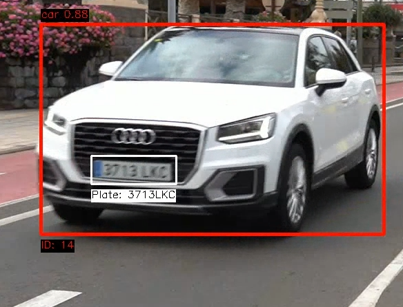

# YOLO Plate Recognition

## Índice

- [YOLO Plate Recognition](#yolo-plate-recognition)
  - [Índice](#índice)
  - [Librerías utilizadas](#librerías-utilizadas)
  - [Implementación y Entrenamiento](#implementación-y-entrenamiento)
    - [Reentramiento del Modelo YOLO con Ultraytics](#reentramiento-del-modelo-yolo-con-ultraytics)
    - [Configuración Inicial y Parámetros](#configuración-inicial-y-parámetros)
      - [Rutas de Video y Modelos](#rutas-de-video-y-modelos)
      - [Configuración de Salida](#configuración-de-salida)
      - [Inicialización de Modelos](#inicialización-de-modelos)
      - [Configuración de Entrada y Salida de Video](#configuración-de-entrada-y-salida-de-video)
      - [Algoritmo Principal de Detección y Seguimiento](#algoritmo-principal-de-detección-y-seguimiento)
      - [Bucle de Fotogramas](#bucle-de-fotogramas)
    - [Procesamiento de Detecciones](#procesamiento-de-detecciones)
    - [Detección y Reconocimiento de Matrículas](#detección-y-reconocimiento-de-matrículas)
    - [Procesamiento de Matrículas usando OpenCV](#procesamiento-de-matrículas-usando-opencv)
      - [Guardar Resultados y Liberación de Recursos](#guardar-resultados-y-liberación-de-recursos)
    - [Resultados](#resultados)
    - [Extra: Funcionalidades de Anonimización](#extra-funcionalidades-de-anonimización)


## Librerías utilizadas

[](https://ultralytics.com/yolo)
[](https://pytorch.org/)
[](https://github.com/tesseract-ocr/tesseract)
[](https://github.com/JaidedAI/EasyOCR)
[](https://opencv.org/)
[](https://developer.nvidia.com/cuda-toolkit)


## Implementación y Entrenamiento

### Reentramiento del Modelo YOLO con Ultraytics
El siguiente script configura y entrena un modelo YOLO usando un archivo `.yaml` para definir las rutas de los datos y las clases:

```python
from ultralytics import YOLO

# Ruta al archivo de configuración .yaml que especifica las rutas de los datos y las clases
yaml_path = "datasets/data.yaml"

# Ruta del modelo YOLO preentrenado que se usará como base
base_model = "yolo11n.pt"  # Asegúrate de usar la versión correcta del modelo

# Configuración de hiperparámetros para el entrenamiento
img_size = 640          # Tamaño de las imágenes
batch_size = 16         # Ajusta según la memoria de tu GPU
epochs = 100            # Número de épocas
device = "cuda:0"       # Especifica la GPU

def train_yolo():
    model = YOLO(base_model)
    
    model.train(
        data=yaml_path,
        imgsz=img_size,
        batch=batch_size,
        epochs=epochs,
        device=device,
        workers=4,                 # Número de trabajadores para la carga de datos
        augment=True,              # Habilita el aumento de datos
        verbose=True,              # Muestra información detallada durante el entrenamiento
        # learning_rate=0.01,      # Puedes especificar una tasa de aprendizaje personalizada
        # weight_decay=0.0005,     # Agrega regularización si es necesario
    )

if __name__ == "__main__":
    train_yolo()
```


### Configuración Inicial y Parámetros

#### Rutas de Video y Modelos
El script comienza definiendo las rutas para:
- `video_path`: La ruta del video de entrada que se va a procesar.
- `model_path`: Modelo YOLO para la detección general de objetos.
- `license_plate_detector_model_path`: Modelo YOLO específico para la detección de matrículas.

```python
video_path = 'C0142.mp4'
model_path = 'yolo11n.pt'
license_plate_detector_model_path = 'runs2/detect/train9/weights/best.pt'
```

#### Configuración de Salida
Define rutas y configuraciones de salida para el video y el archivo CSV, incluyendo las clases a detectar:
```python
output_video_path = 'output_video.mp4'
csv_file_path = 'detection_tracking_log.csv'
show_video = True
classes_to_detect = [0, 1, 2, 3, 5]
```

#### Inicialización de Modelos
Se inicializan los modelos YOLO y el detector de matrículas, además de un lector OCR (`easyocr`) para la extracción de texto de matrículas.
```python
model = YOLO(model_path)
license_plate_detector = YOLO(license_plate_detector_model_path)
reader = easyocr.Reader(['en'], gpu=True)
```

#### Configuración de Entrada y Salida de Video

El código prepara el video para su captura utilizando `cv2.VideoCapture` y configura el video de salida.
```python
cap = cv2.VideoCapture(video_path)
fourcc = cv2.VideoWriter_fourcc(*'mp4v')
fps = cap.get(cv2.CAP_PROP_FPS)
frame_width = int(cap.get(cv2.CAP_PROP_FRAME_WIDTH))
frame_height = int(cap.get(cv2.CAP_PROP_FRAME_HEIGHT))
out = cv2.VideoWriter(output_video_path, fourcc, fps, (frame_width, frame_height))
```

---

#### Algoritmo Principal de Detección y Seguimiento

#### Bucle de Fotogramas
El código entra en un bucle que procesa cada fotograma del video e incrementa el contador de fotogramas:
```python
ret, frame = cap.read()
frame_number += 1
```

### Procesamiento de Detecciones
YOLO detecta objetos en el fotograma según `classes_to_detect`. Para cada objeto detectado:
1. **Extracción de Coordenadas y Clase**: Obtiene la caja delimitadora y la confianza del objeto.
2. **Seguimiento de ID Único**: Cuenta e identifica objetos únicos usando `track_id`.
3. **Almacenamiento de Datos del Objeto**: Guarda datos como clase, confianza y detalles del fotograma en `object_info`.
4. **Anotación**: Dibuja cajas alrededor de cada objeto detectado y añade etiquetas de clase y confianza.

```python
results = model.track(frame, persist=True, classes=classes_to_detect)
```

---

### Detección y Reconocimiento de Matrículas

Para cada vehículo detectado (auto, motocicleta, autobús):
1. **Región de Interés (ROI) del Vehículo**: Recorta la región del vehículo detectado en el fotograma.
2. **Detección de Matrículas**: Ejecuta el modelo YOLO de matrículas en la región recortada.
3. **Extracción de Texto con OCR**: Extrae el texto de la matrícula con `easyocr`, guardando el texto con mayor confianza en `object_info`.
4. **Anotaciones**: Dibuja cajas alrededor de las matrículas y muestra el texto en el fotograma.

```python
vehicle_img = frame[y1:y2, x1:x2]
plate_results = license_plate_detector.predict(vehicle_img)
output, _ = upsampler.enhance(np.array(license_plate_roi), outscale=4)
plate_ocr_results = reader.readtext(enhanced_license_plate, allowlist='0123456789ABCDEFGHIJKLMNOPQRSTUVWXYZ')
```

### Procesamiento de Matrículas usando OpenCV

En el proyecto, una vez detectada una matrícula dentro de la región del vehículo, aplicamos una serie de operaciones de OpenCV para mejorar la calidad de la imagen y optimizar el reconocimiento OCR. Los pasos específicos son los siguientes:

1. **Recorte de la Región de la Matrícula**: Primero, se recorta la región de la imagen donde se encuentra la matrícula utilizando las coordenadas detectadas por el modelo. Esto se almacena en la variable `license_plate_roi`.

```python
license_plate_roi = frame[py1:py2, px1:px2]
```
2. **Redimensionado de la Imagen**: Para mejorar la legibilidad del texto, redimensionamos la imagen de la matrícula a una altura fija de 100 píxeles. Usamos el factor de escala correspondiente para que la imagen mantenga las proporciones originales.

```python
plate_height, plate_width = license_plate_roi.shape[:2]
scale_factor = 100.0 / plate_height
resized_plate = cv2.resize(
license_plate_roi, None, fx=scale_factor, fy=scale_factor,
interpolation=cv2.INTER_CUBIC)
```

3. **Conversión a Escala de Grises**: Convertimos la imagen a escala de grises para reducir la complejidad de procesamiento y enfocarnos en la información de luminancia necesaria para el OCR.

```python
gray_plate = cv2.cvtColor(resized_plate, cv2.COLOR_BGR2GRAY)
```
4. **Mejora de Contraste con CLAHE**: Para mejorar el contraste de la imagen, aplicamos el algoritmo de Ecualización Adaptativa de Histograma con Limitación de Contraste (CLAHE). Este proceso ayuda a resaltar los caracteres en la imagen.

```python
clahe = cv2.createCLAHE(clipLimit=2.0, tileGridSize=(8,8))
equalized_plate = clahe.apply(gray_plate)
```

5. **Reducción de Ruido**: Usamos el método `fastNlMeansDenoising` de OpenCV para reducir el ruido en la imagen sin afectar significativamente los bordes de los caracteres, lo cual es crucial para la precisión del OCR.

```python
denoised_plate = cv2.fastNlMeansDenoising(equalized_plate, None, 10, 7, 21)
```

6. **Umbral Adaptativo**: Para mejorar la detección de los caracteres, aplicamos un umbral adaptativo con el método cv2.adaptiveThreshold. Esto convierte la imagen en blanco y negro, resaltando las áreas de texto sobre el fondo.

```python
thresh_plate = cv2.adaptiveThreshold(
denoised_plate, 255, cv2.ADAPTIVE_THRESH_GAUSSIAN_C,
cv2.THRESH_BINARY_INV, 11, 2)
```

7. **Operaciones Morfológicas**: Finalmente, aplicamos operaciones morfológicas para mejorar aún más la claridad de los caracteres y eliminar el ruido restante. Usamos un elemento estructurante rectangular para cerrar pequeños huecos en los caracteres y luego aplicamos una operación de apertura para eliminar el ruido externo.

```python
kernel = cv2.getStructuringElement(cv2.MORPH_RECT, (3, 3))
morph_plate = cv2.morphologyEx(thresh_plate, cv2.MORPH_CLOSE, kernel)
morph_plate = cv2.morphologyEx(morph_plate, cv2.MORPH_OPEN, kernel)
morph_plate = cv2.bitwise_not(morph_plate)
```

Este proceso de mejoras y limpieza de la imagen optimiza el rendimiento de OCR, permitiendo al sistema reconocer los caracteres de la matrícula con mayor precisión.

---

#### Guardar Resultados y Liberación de Recursos

Después de procesar todos los fotogramas, la información de detección de objetos se guarda en un archivo CSV, y se liberan los recursos para evitar problemas de memoria.

```python
with open(csv_file_path, mode='w', newline='') as file:
    writer = csv.writer(file)
    writer.writerow([...])
    for track_id, info in object_info.items():
        writer.writerow([...])
cap.release()
out.release()
cv2.destroyAllWindows()
```

### Resultados



### Extra: Funcionalidades de Anonimización

Este proyecto incluye funcionalidades avanzadas para la anonimización de personas y matrículas en el video. A continuación se detalla cada una:

- **Anonimización de Personas**: Detecta y aplica un efecto de desenfoque a las personas en el video.
- **Anonimización de Matrículas**: Para vehículos identificados, se aplica desenfoque sobre las matrículas visibles.
- **Control de Anonimización con la tecla "B"**: La tecla "B" habilita o deshabilita el efecto de desenfoque de manera dinámica durante el procesamiento del video. Esto permite al usuario decidir, en tiempo real, si se quiere aplicar el efecto de anonimización.


