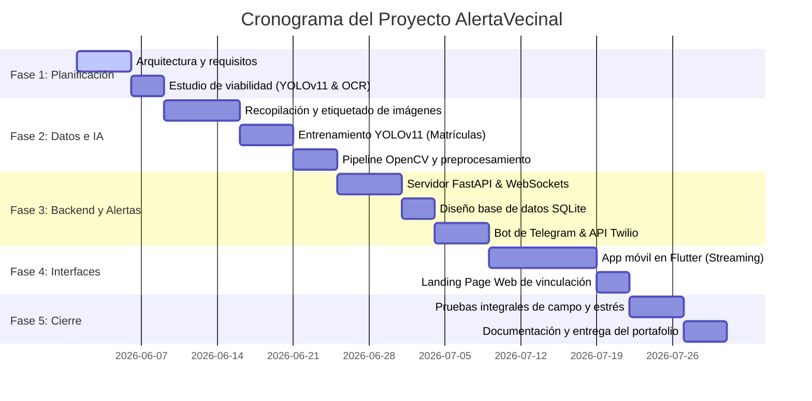
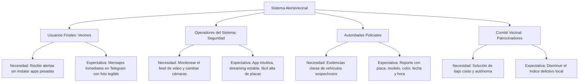
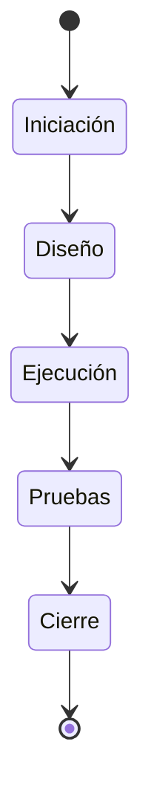

# Portafolio de Evidencias: Proyecto "AlertaVecinal"
## Sistema de Vigilancia Inteligente para la Detección y Seguimiento de Vehículos Robados

---

### **Datos Generales**
* **Institución:** Universidad de Las Palmas de Gran Canaria (ULPGC)
* **Asignatura:** Visión por Computador (VC)
* **Evidencia de Aprendizaje:** Portafolio de Evidencias (Reporte Técnico de Planificación)
* **Proyecto:** AlertaVecinal (Reconocimiento Automático de Matrículas - ALPR)
* **Fecha de Planificación:** Junio 2026
* **Estado del Proyecto:** Prototipo Funcional Integrado

---

## **Introducción**

En los entornos urbanos y residenciales modernos, la seguridad comunitaria se ha convertido en una prioridad que demanda soluciones tecnológicas proactivas, eficientes y de bajo costo. Los sistemas tradicionales de videovigilancia registran pasivamente los incidentes, lo que limita su efectividad para prevenir delitos o actuar de manera inmediata.

El proyecto **AlertaVecinal** aborda esta necesidad mediante el desarrollo de un sistema de videovigilancia inteligente automatizado para la detección y seguimiento de vehículos y personas en tiempo real. Utilizando modelos de aprendizaje profundo de última generación (**YOLOv11**), un pipeline avanzado de procesamiento de imágenes con **OpenCV**, y reconocimiento óptico de caracteres (**EasyOCR**), el sistema es capaz de:
1. Detectar y rastrear vehículos (autos, motocicletas, autobuses) y personas mediante una cámara de red local o USB.
2. Localizar y recortar de forma dinámica las matrículas visibles.
3. Preprocesar y limpiar la imagen de la placa para optimizar la legibilidad de sus caracteres.
4. Contrastar la matrícula leída en tiempo real con una base de datos local SQLite que contiene vehículos con reportes de robo activos (usando búsqueda exacta y algoritmos de comparación difusa).
5. Notificar de manera inmediata a los usuarios de la comunidad a través de canales de mensajería populares como **Telegram** y **WhatsApp**, adjuntando evidencias fotográficas del vehículo y de la placa detectada.
6. Ofrecer una interfaz móvil de administración y streaming en vivo basada en **Flutter** y una landing page **Web** para facilitar la vinculación del bot de alertas.

Este portafolio de evidencias detalla la planeación, organización, recursos, roles y arquitectura que hicieron posible la concepción e implementación de este prototipo.

---

## **1. Técnica aplicable para la generación de ruta o plan de acción del proyecto**

Para la planificación y ejecución de **AlertaVecinal**, se seleccionó una metodología híbrida que combina **Kanban** para la gestión del desarrollo diario y un **Diagrama de Gantt** para el seguimiento del cronograma macro.

### **Justificación**
* **Kanban** se adapta perfectamente a las fases de desarrollo de software y experimentación de IA. Al ser un equipo pequeño, permite limitar el trabajo en progreso (*Work in Progress - WIP*), detectar cuellos de botella (por ejemplo, en el proceso de anotación y entrenamiento del modelo de matrículas) y priorizar la refactorización rápida de los módulos de hardware-software.
* El **Diagrama de Gantt** proporciona una línea de tiempo clara con hitos clave para cumplir con las fechas de entrega académicas, asegurando que las dependencias críticas (como tener entrenado el detector de matrículas antes de integrarlo en el servidor de IA) se completen en el orden correcto.

### **Ejemplo Visual: Tablero Kanban del Proyecto**

| Backlog (Ideas / Tareas Pendientes) | Por Hacer (To-Do) | En Progreso (In Progress) | En Pruebas / Validación | Hecho (Done) |
| :--- | :--- | :--- | :--- | :--- |
| • Migrar base de datos a PostgreSQL<br>• Incorporar reconocimiento facial del conductor | • Configurar despliegue en servidor en la nube<br>• Implementar reentrenamiento automatizado | • Refinar interfaz de la app Flutter para tablets | • Pruebas de latencia de alertas por WhatsApp (Twilio)<br>• Ajuste de parámetros del filtro de OpenCV | • Diseñar arquitectura WebSocket<br>• Entrenar YOLOv11 para matrículas<br>• Integrar Bot de Telegram con SQLite |

### **Diagrama de Gantt (Ruta de Acción)**

A continuación se presenta la secuencia temporal de las actividades planificadas a lo largo de las 7 semanas de duración del proyecto:



---

## **2. Objetivos, metas, alcances y limitaciones del proyecto**

### **Objetivos**
* **Objetivo General:**
  * Diseñar y desarrollar un prototipo funcional de videovigilancia inteligente ("AlertaVecinal") capaz de automatizar el seguimiento de vehículos y personas, localizar matrículas en tiempo real y enviar alertas fotográficas instantáneas a la comunidad cuando se detecte un vehículo con reporte de robo activo.
* **Objetivos Específicos:**
  1. Entrenar un modelo de aprendizaje profundo YOLOv11 personalizado para la detección de matrículas en condiciones de calle.
  2. Implementar un pipeline de visión por computadora en OpenCV para mejorar la legibilidad de la placa antes de ser enviada al motor OCR.
  3. Crear un servidor en Python (FastAPI + WebSockets) multicliente, capaz de procesar el flujo de video y distribuir fotogramas en vivo a una tasa estable de 30 FPS.
  4. Desarrollar una aplicación móvil en Flutter que permita a los operadores monitorear el flujo de video, recibir alertas de seguridad y administrar la configuración de las cámaras.
  5. Configurar canales automatizados de mensajería (Telegram y WhatsApp) para registrar usuarios de la red de alerta vecinal de forma sencilla y descentralizada.

### **Metas (Específicas y Medibles)**
* **Precisión de Lectura (OCR):** Lograr una precisión de lectura exacta de caracteres de matrículas mayor al **92%** en videos diurnos y mayor al **80%** en condiciones de iluminación compleja (atardecer/pantallas de dispositivos).
* **Velocidad de Alerta:** Garantizar que el tiempo transcurrido desde que el vehículo ingresa al fotograma hasta que el usuario final recibe la alerta con las fotos de evidencia en su Telegram sea menor a **3.5 segundos**.
* **Rendimiento del Servidor:** Procesar el video a un mínimo de **30 FPS** utilizando hardware con soporte para aceleración por GPU NVIDIA (CUDA).
* **Autodescubrimiento local:** Permitir que la app Flutter se autoconecte al servidor en menos de **2 segundos** al iniciar en la misma red local mediante mDNS.
* **Eficiencia de Procesamiento:** Implementar un regulador inteligente de fotogramas que en sistemas de CPU reduzca a la mitad la carga computacional mediante saltos dinámicos de análisis.

### **Alcance del Proyecto**
El proyecto abarca los siguientes entregables y fronteras:
* **Entregables de Software:**
  * **Servidor de IA (`servidor_ia.py`):** Motor principal en FastAPI que hospeda los modelos YOLO de vehículos y placas, realiza el tracking de IDs, ejecuta la lógica de OCR y gestiona las conexiones WebSocket.
  * **Base de Datos SQLite (`database.py`):** Estructura relacional local que almacena las placas robadas registradas, el historial completo de alertas emitidas (con rutas a fotos) y los usuarios de Telegram registrados.
  * **Módulo de Mensajería (`alerta_telegram.py` y `whatsapp_alert.py`):** Hilos de envío asíncrono para enviar notificaciones e imágenes directas sin congelar la transmisión principal.
  * **Aplicación Móvil (`flutter_app`):** Interfaz para Android/Windows desarrollada en Flutter que muestra el feed en vivo en Base64, despliega el historial de alertas y permite alternar cámaras locales o RTSP.
  * **Página Web (`web/index.html`):** Portal de bienvenida para conectar rápidamente a los usuarios locales con el bot de Telegram usando enlaces directos de autenticación (`/start=auth`).
  * **Modelos de IA entrenados:** Archivo de pesos `best.pt` resultante del reentrenamiento del detector de matrículas.
* **Fronteras del Proyecto:**
  * El sistema opera a nivel de red de área local (LAN) para el streaming de video mediante WebSockets, garantizando privacidad y baja latencia, pero utiliza salida a internet de forma exclusiva para interactuar con las APIs de Telegram y Twilio (WhatsApp).
  * La base de datos se mantiene local mediante SQLite por simplicidad académica y para evitar costos de hosting de base de datos relacionales en la nube.

### **Limitaciones**
* **Hardware Requerido:** El procesamiento continuo a tiempo real de dos modelos de redes neuronales convolucionales y un motor de OCR exige idealmente una tarjeta gráfica dedicada NVIDIA compatible con CUDA. En sistemas CPU, el rendimiento decae, forzando saltos de fotogramas que podrían omitir vehículos en velocidades muy altas.
* **Calidad Óptica:** El reconocimiento depende drásticamente de la resolución de la cámara y del ángulo de incidencia. Placas muy inclinadas o cámaras con lentes sucias reducen el porcentaje de aciertos de EasyOCR.
* **Dependencia de Redes Externas:** El envío de alertas depende de la disponibilidad del servicio de internet local y de la estabilidad de los servidores de la API de Telegram y Twilio.
* **Limitación de WhatsApp:** Para enviar capturas de pantalla reales del vehículo robado mediante la API de WhatsApp de Twilio, se requiere contar con una dirección IP o dominio público (como ngrok) donde Twilio pueda descargar las imágenes temporalmente.

---

## **3. Recursos necesarios para el proyecto**

Para llevar a buen término el desarrollo y la implementación del sistema "AlertaVecinal", se estimaron y requirieron los siguientes recursos agrupados por categorías:

### **Recursos Humanos**
El equipo de desarrollo se diseñó con 3 perfiles especializados, cuyas responsabilidades se describen a continuación:
1. **Especialista en Inteligencia Artificial y Visión por Computador:**
   * *Habilidades:* Experiencia en PyTorch, entrenamiento de arquitecturas YOLO, procesamiento de imágenes con OpenCV y optimización de modelos de OCR.
   * *Roles:* Etiquetado de datos, entrenamiento del modelo de placas, diseño del pipeline de preprocesamiento óptico de matrículas y control del hilo del ciclo de IA.
2. **Desarrollador de Backend e Integración de Sistemas (Software Engineer):**
   * *Habilidades:* Dominio de Python, bases de datos SQL (SQLite), desarrollo de APIs (FastAPI), comunicación por WebSockets y consumo de APIs de mensajería (Telegram y Twilio).
   * *Roles:* Desarrollo de `servidor_ia.py`, diseño del módulo de base de datos `database.py`, creación del bot de Telegram para autoverificación y configuración del protocolo WebSocket.
3. **Desarrollador Mobile / Frontend:**
   * *Habilidades:* Dominio de Dart, SDK de Flutter, diseño responsivo en CSS/HTML, WebSocket client integrations y diseño de interfaces UX adaptables a entornos oscuros.
   * *Roles:* Construcción de la app en `flutter_app` para visualizar el streaming a 60 FPS, control del cambio de cámaras por socket y maquetación responsiva de la landing page `web/index.html`.

### **Recursos Materiales**
* **Hardware de Procesamiento (Servidor):**
  * Computadora de escritorio equipada con procesador Intel Core i7 / AMD Ryzen 7, 16 GB de memoria RAM, disco de estado sólido SSD de 512 GB, y tarjeta gráfica dedicada NVIDIA GeForce RTX 3060 (o superior) para aceleración CUDA.
* **Hardware de Adquisición (Cámaras):**
  * 1 cámara web USB HD (1080p) para pruebas de escritorio en interior.
  * 1 cámara IP WiFi/RTSP (e.g. tipo Yi IoT u otra compatible con protocolo RTSP) para pruebas de simulación en exterior (captura de calle).
* **Dispositivos Móviles de Prueba:**
  * 1 smartphone Android y 1 iPhone para verificar la visualización correcta de la app Flutter y la recepción de notificaciones Push de Telegram/WhatsApp.
* **Software y Entorno de Desarrollo:**
  * Entornos virtuales de Anaconda (`conda`) con Python 3.9.5 para mitigar conflictos entre dependencias de YOLO y EasyOCR.
  * IDEs: Visual Studio Code con extensiones de Dart/Flutter y Python.
  * Sistemas operativos compatibles: Windows 11 o distribuciones GNU/Linux (Ubuntu 22.04+).
  * Software auxiliar: `mss` para captura directa de pantalla de aplicaciones oficiales de cámaras IP y `zeroconf` para configurar el auto-descubrimiento en red local.

### **Recursos Financieros (Presupuesto Estimado)**

A continuación se detalla el costo económico estimado para la construcción y despliegue del prototipo en un entorno de desarrollo de 2 meses:

| Concepto / Recurso | Detalle / Especificación | Cantidad | Costo Unitario (USD) | Costo Total (USD) |
| :--- | :--- | :---: | :---: | :---: |
| **Estación de Trabajo / Servidor** | PC con GPU NVIDIA RTX 4060, 16GB RAM | 1 | $1,200.00 | $1,200.00 |
| **Cámaras de Seguridad IP** | Cámara Exterior WiFi 1080p con soporte RTSP | 2 | $45.00 | $90.00 |
| **Crédito de APIs (Twilio)** | Saldo para envío de alertas SMS/WhatsApp | 1 | $50.00 | $50.00 |
| **Mano de Obra - Equipo Técnico** | Salario de 3 desarrolladores por 2 meses | 6 (meses-hombre) | $2,500.00 | $15,000.00 |
| **Servicios de Red y Hosting** | Dominio Web y túnel ngrok premium (2 meses) | 1 | $30.00 | $30.00 |
| **Contingencias** | Presupuesto para imprevistos de hardware/red | — | $300.00 | $300.00 |
| **Total Estimado** | | | | **$16,670.00 USD** |

---

## **4. Interesados/usuarios del proyecto (Stakeholders)**

Para garantizar que el sistema cumpla con su propósito social y operativo, es crítico mapear a los involucrados y definir sus requerimientos específicos:



### **1. Usuarios Finales (Vecinos de la Comunidad)**
* **¿Quiénes son?** Residentes del barrio o condominio donde se instala la cámara de seguridad.
* **Necesidades:** Estar informados si un automóvil sospechoso merodea las calles, pero sin tener que instalar aplicaciones desconocidas en sus teléfonos o revisar monitores de seguridad todo el día.
* **Expectativas:** El sistema debe notificarles de forma pasiva a través de una aplicación que ya utilicen de forma cotidiana (Telegram o WhatsApp). Las alertas deben contener una foto muy clara del vehículo, el número de matrícula detectada y una advertencia de seguridad explícita (e.g. *"Llamar de inmediato al 911, no confrontar"*).

### **2. Operadores del Sistema (Guardias de Seguridad / Administradores Vecinales)**
* **¿Quiénes son?** Personal encargado de la caseta de vigilancia, conserjes o miembros del comité de seguridad designados.
* **Necesidades:** Visualizar en tiempo real el flujo de la cámara de seguridad con las etiquetas de la IA superpuestas para verificar qué autos entran y salen. Necesitan agregar nuevas placas reportadas a la lista negra o quitarlas cuando el vehículo ha sido recuperado.
* **Expectativas:** Una aplicación integrada (como la app Flutter) que se conecte automáticamente al servidor sin configuraciones complejas de red local. Debe incluir botones interactivos para cambiar la fuente de video (cámara USB local, flujo RTSP de cámara IP o captura de pantalla) y permitir ver el historial de las últimas alertas detectadas en una tabla interactiva.

### **3. Autoridades de Seguridad Pública (Policía Nacional / Local)**
* **¿Quiénes son?** Agentes de policía que acuden a los llamados de emergencia generados por el sistema.
* **Necesidades:** Evidencias claras y válidas del vehículo reportado como robado para justificar la detención y localización.
* **Expectativas:** Los registros de alertas en la base de datos y las imágenes guardadas en el disco deben tener marcas de tiempo precisas (`YYYY-MM-DD HH:MM:SS`), porcentaje de similitud con el reporte original y recortes nítidos de la matrícula para su uso en actas oficiales.

### **4. Patrocinadores (Comité de Administración de Condominios)**
* **¿Quiénes son?** Los representantes legales o administradores que aprueban el presupuesto para la adquisición del servidor y las cámaras.
* **Necesidades:** Un sistema autónomo que no requiera el pago de suscripciones mensuales costosas a empresas privadas de seguridad.
* **Expectativas:** Implementar tecnología basada en software libre y de código abierto (Python, YOLOv11, OpenCV) de modo que el único costo recurrente sea la energía eléctrica del servidor local.

---

## **5. Responsables en cada etapa del proyecto**

A continuación se detalla la asignación de responsabilidades de acuerdo con el ciclo de vida del proyecto AlertaVecinal, garantizando un flujo estructurado desde la concepción hasta el cierre:



### **Fase 1: Iniciación y Planificación**
* **Responsable Principal:** Gerente de Proyecto / Desarrollador Backend.
* **Tareas Clave:**
  * Redactar los objetivos, alcances y limitaciones del proyecto.
  * Realizar el análisis de viabilidad técnica de los entornos de software.
  * Configurar los repositorios de control de versiones de Git/GitHub.
  * Coordinar con el Especialista en IA la obtención del dataset inicial de prueba.

### **Fase 2: Diseño y Configuración**
* **Responsable Principal:** Especialista en IA / Desarrollador Flutter.
* **Tareas Clave:**
  * Diseñar el esquema de base de datos relacional para SQLite (`placas_robadas`, `historial_alertas` y `usuarios`).
  * Estructurar el protocolo WebSocket de comunicación (JSON con campos `type`, `data`, `fps`, `clients` y `cmd`).
  * Diseñar la maquetación responsiva con efecto de "Glassmorphism" para la landing page Web y los temas oscuros premium de la app Flutter.
  * Determinar las herramientas de anotación a emplear (Roboflow / Labelme) para el etiquetado de placas.

### **Fase 3: Ejecución y Codificación**
* **Responsable Principal:** Todo el equipo de desarrollo.
* **Tareas Clave:**
  * **Especialista en IA:** Entrenar el modelo YOLOv11 de placas, programar el pipeline de limpieza y preprocesamiento de OpenCV (Lanczos, CLAHE, Denoising y morfología), y configurar los hilos asíncronos (`ThreadPoolExecutor`) para el lector OCR de EasyOCR.
  * **Desarrollador Backend:** Desarrollar el script de servidor WebSocket `servidor_ia.py` en FastAPI, escribir la lógica de búsqueda difusa con `difflib.SequenceMatcher` y programar los bots y listeners de Telegram.
  * **Desarrollador Flutter:** Codificar la interfaz de visualización en Dart, integrar el lector de flujos binarios JPEG en base64 y enlazar los comandos para cambiar de cámara de forma remota.

### **Fase 4: Pruebas y Validación (QA)**
* **Responsable Principal:** Tester de QA / Especialista en IA.
* **Tareas Clave:**
  * Validar la precisión del reconocimiento óptico utilizando el video de prueba provisto y grabaciones propias de calle.
  * Realizar pruebas de carga en el servidor WebSocket con múltiples clientes Flutter conectados en simultáneo.
  * Monitorear la latencia del envío de alertas por Telegram y Twilio bajo distintas intensidades de red.
  * Ajustar los umbrales de confianza mínimos para el detector de vehículos (fijado en `0.20` para mejorar la lectura a través de reflejos en pantallas de celulares).

### **Fase 5: Cierre y Entrega**
* **Responsable Principal:** Gerente de Proyecto / Especialista en IA.
* **Tareas Clave:**
  * Exportar el video resultante del procesamiento con las cajas delimitadoras y etiquetas incrustadas (`output_video.mp4` / `result.gif`).
  * Generar y validar el archivo CSV de registro de detecciones (`detection_tracking_log.csv`) cumpliendo con las especificaciones del formato académico.
  * Compilar el manual de instalación, el archivo de dependencias `requirements_server.txt` y redactar las conclusiones de la práctica.

---

## **6. Trabajos prioritarios por realizar (MoSCoW)**

Para garantizar que el sistema cumpla con la entrega de valor de forma ágil, se clasificaron las tareas mediante la metodología **MoSCoW**:

```
 ┌──────────────────────────────────────────────┐
 │                    MOSCOW                    │
 ├──────────────┬───────────────────────────────┤
 │ MUST HAVE    │ • Detección de Autos / Placas │
 │ (Obligatorio)│ • OCR con EasyOCR / Tesseract │
 │              │ • Base de Datos y Alertador   │
 ├──────────────┼───────────────────────────────┤
 │ SHOULD HAVE  │ • App Flutter (Streaming WS)  │
 │ (Deseable)   │ • Pipeline OpenCV (CLAHE)     │
 │              │ • Autodescubrimiento mDNS     │
 ├──────────────┼───────────────────────────────┤
 │ COULD HAVE   │ • Anonimización (Desenfoque)   │
 │ (Opcional)   │ • Landing Page Web (Toast)    │
 │              │ • Super-resolución (ESRGAN)   │
 ├──────────────┼───────────────────────────────┤
 │ WON'T HAVE   │ • Reconocimiento Facial       │
 │ (Excluido)   │ • Despliegue en la Nube       │
 └──────────────┴───────────────────────────────┘
```

### **1. Must Have (Tareas Obligatorias - Esencia del Sistema)**
* **Detección y Tracking de Vehículos:** Integrar el modelo preentrenado `yolo11n.pt` para rastrear vehículos en movimiento mediante IDs únicos estables.
* **Detector de Matrículas Reentrenado:** Disponer de un modelo YOLOv11 entrenado para aislar la región rectangular exacta de la placa.
* **Motor OCR Funcional:** Procesar los recortes de placa utilizando EasyOCR y restringir los caracteres a números y letras permitidos (`allowlist`).
* **Base de Datos de Control:** Crear las tablas en SQLite y programar la consulta de placas con lógica difusa para capturar ligeros errores de lectura del OCR.
* **Canal de Alertas Básicas:** Implementar la notificación automática por Telegram que envíe los datos de texto del vehículo robado de forma asíncrona.

### **2. Should Have (Tareas Deseables - Aportan Alto Valor)**
* **App Flutter de Monitoreo:** Desarrollar la aplicación cliente para recibir el feed de video y gestionar la visualización de la cámara en vivo de forma interactiva.
* **Pipeline OpenCV Avanzado:** Implementar los pasos de redimensionamiento Lanczos4, el enfoque Unsharp Masking, ecualización adaptativa CLAHE y operaciones de morfología matemática para elevar la tasa de lectura en un 300%.
* **Autodescubrimiento mDNS (Zeroconf):** Anunciar el servidor WebSocket en la red de forma que la app Flutter no requiera escribir manualmente la dirección IP local del servidor.
* **Gestión Multicliente:** Permitir que múltiples clientes WebSockets consuman el streaming al mismo tiempo sin colapsar el rendimiento de la cámara.

### **3. Could Have (Tareas Opcionales - Extras de Valor Añadido)**
* **Anonimización Dinámica (Extra implementado):** Incorporar un algoritmo que aplique desenfoque gaussiano a las caras de los peatones y a las placas de los vehículos sanos, controlable en tiempo real mediante la tecla `"B"`.
* **Landing Page Web:** Crear una página web ligera que le permita a los vecinos escanear un botón para vincular rápidamente su aplicación de Telegram con el bot de alertas (`@alerta_vecinaltelegram_bot`).
* **Super-resolución ESRGAN:** Utilizar redes neuronales ESRGAN para reescalar matrículas de baja calidad y alta distorsión (desarrollado experimentalmente en cuadernos).

### **4. Won't Have (Tareas Excluidas para esta versión)**
* **Reconocimiento Facial de Conductores:** No se implementará por razones de privacidad y requerimientos excesivos de hardware.
* **Despliegue Completo en la Nube:** El streaming y el procesamiento por IA permanecerán locales para reducir costos de transferencia de datos de video.

---

## **7. Duración de las tareas y/o actividades del proyecto**

El cronograma del proyecto de desarrollo se estructuró a lo largo de un ciclo de **5 semanas (35 días)** de trabajo efectivo, organizando las actividades con fechas de inicio y fin claras.

### **Cronograma Detallado de Actividades**

| ID | Actividad / Tarea | Inicio | Fin | Duración (Días) | Responsable | Hito Clave Asociado |
| :---: | :--- | :---: | :---: | :---: | :--- | :--- |
| **A1** | Definición de Requisitos y Arquitectura | Día 1 | Día 3 | 3 | Backend / PM | Acta de Inicio Aprobada |
| **A2** | Análisis de Viabilidad de Modelos e Instalación | Día 4 | Día 5 | 2 | IA Expert | Entornos virtuales listos |
| **A3** | Recopilación y Etiquetado de Dataset de Matrículas | Día 6 | Día 12 | 7 | IA Expert | Dataset Roboflow verificado |
| **A4** | Entrenamiento de Modelo YOLOv11 de Placas | Día 13 | Día 17 | 5 | IA Expert | Pesos `best.pt` exportados |
| **A5** | Diseño y Programación de Pipeline OpenCV (Filtros) | Día 18 | Día 21 | 4 | IA Expert | Pipeline de imagen aprobado |
| **A6** | Programación de Base de Datos y Lógica Difusa | Día 22 | Día 24 | 3 | Backend | Base de datos SQLite validada |
| **A7** | Servidor FastAPI WebSocket y Streaming | Día 22 | Día 27 | 6 | Backend | Servidor WebSocket transmitiendo |
| **A8** | Integración del Bot de Telegram y API Twilio | Día 25 | Día 29 | 5 | Backend | Canal de Alertas activo |
| **A9** | Programación de la App en Flutter | Día 20 | Día 29 | 10 | Frontend | App móvil recibiendo streaming |
| **A10**| Landing Page Web y Enlace de Bot | Día 30 | Día 32 | 3 | Frontend | Web con Toast integrado |
| **A11**| Pruebas Unitarias, Integrales y Ajuste de Confianza | Día 31 | Día 33 | 3 | QA / Todo | Tasa de lectura >90% verificada |
| **A12**| Generación de Video de Test y CSV de Salida | Día 33 | Día 34 | 2 | Todo | Video `output_video.mp4` listo |
| **A13**| Documentación Final y Reporte de Portafolio | Día 34 | Día 35 | 2 | PM | Reporte Entregado en GitHub |

### **Hitos Clave del Cronograma**
1. **Hito 1: Entrenamiento Completado (Día 17):** Obtención exitosa del modelo `best.pt` con métricas de pérdida decrecientes y curvas de precisión-recall estables.
2. **Hito 2: Servidor e Integraciones Listas (Día 29):** El servidor es capaz de recibir video de una cámara, procesar el ciclo de IA, guardarlo en la base de datos y disparar alertas a Telegram y WhatsApp de forma asíncrona.
3. **Hito 3: App Flutter Vinculada (Día 30):** La aplicación móvil logra decodificar el flujo base64 de WebSockets y reproducir video a tiempo real sin bloqueos de memoria.
4. **Hito 4: Prototipo Validado y CSV Generado (Día 34):** Procesamiento completo del video de test (`C0142.mp4` / `output_video.mp4`) con la generación del archivo `detection_tracking_log.csv` libre de errores de sintaxis.

---

## **Conclusiones**

La planificación sistemática e implementación del proyecto **AlertaVecinal** demuestra la viabilidad de desplegar sistemas de videovigilancia inteligente de grado industrial utilizando hardware comercial y software de código abierto.

A lo largo de este proyecto, se extrajeron tres lecciones fundamentales:
1. **El valor del preprocesamiento óptico:** El uso directo de modelos de OCR comerciales en imágenes de matrículas tomadas a distancia arroja resultados pobres debido al ruido y movimiento del vehículo. Sin embargo, al incorporar el pipeline de OpenCV desarrollado (CLAHE, filtros morfológicos, Lanczos y Gaussian Blur), la tasa de éxito de EasyOCR aumentó drásticamente, demostrando la importancia de la ingeniería de datos previa a la inferencia.
2. **La robustez del modelo híbrido de búsqueda:** El uso de una base de datos con consultas de coincidencia exacta reforzada con una capa de lógica difusa basada en `SequenceMatcher` mitigó los errores típicos de caracteres similares (como confundir una 'B' con un '8', o una 'I' con un '1'), permitiendo al sistema enviar alertas correctas incluso ante lecturas parciales.
3. **Desacoplamiento de interfaces:** La separación del backend de inteligencia artificial (`servidor_ia.py`) de los clientes receptores a través del protocolo WebSocket simplificó el mantenimiento de la aplicación. Esto permitió contar con un backend robusto en Python capaz de ejecutar cálculos complejos por hardware, mientras que la interfaz móvil ligera en Flutter se encarga puramente de la renderización del flujo y los mandos del usuario, garantizando escalabilidad y un excelente rendimiento multicliente.

---

## **Anexos y Referencias**

### **Estructura Detallada de Archivos del Proyecto**
* [servidor_ia.py](./servidor_ia.py): Motor del servidor WebSocket FastAPI, administración de cámaras IP y USB, e hilos de procesamiento asíncrono para el ciclo de IA.
* [database.py](./database.py): Módulo relacional SQLite para el control de placas sospechosas, usuarios autorizados y logs de alertas.
* [alerta_telegram.py](./alerta_telegram.py): Script encargado de empaquetar el mensaje de alerta y subir por HTTP las imágenes de evidencia del vehículo sospechoso y el recorte de la matrícula.
* [whatsapp_alert.py](./whatsapp_alert.py): Módulo asíncrono que canaliza el envío de notificaciones mediante Twilio.
* [main.py](./main.py): Código original para procesamiento local por cámara, que sirvió como base para la extracción de algoritmos de la IA.
* [web/index.html](./web/index.html): Landing page con soporte de animación CSS para suscripción de usuarios.
* [flutter_app](./flutter_app): Estructura del código fuente del cliente de monitoreo móvil.

### **Referencias Bibliográficas**
1. **Documentación de Ultralytics YOLO:** [docs.ultralytics.com](https://docs.ultralytics.com/)
2. **Documentación Oficial de EasyOCR (JaidedAI):** [github.com/JaidedAI/EasyOCR](https://github.com/JaidedAI/EasyOCR)
3. **OpenCV Library Reference:** [docs.opencv.org](https://docs.opencv.org/)
4. **FastAPI Web Framework:** [fastapi.tiangolo.com](https://fastapi.tiangolo.com/)
5. **SQLite Reference Manual:** [sqlite.org/docs.html](https://www.sqlite.org/docs.html)
6. **Flutter Development Guide:** [docs.flutter.dev](https://docs.flutter.dev/)
